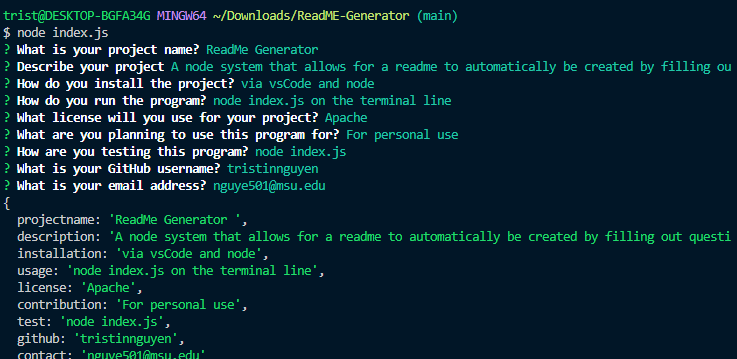

# READMe Generator 

Challenge 9-- README Generator 

    Created via VSCode

    Utilizing javascript and node to create a "form" that allows someone to automatically generate a readme file for their project. With the goal of a creating one that is throrough and detailed so that it is clear what the project is.

    Also used were inquirer package, fs package, and generateMarkdown, all can be found in the package.json file.

Project found on [GitHub](https://github.com/TristinNguyen/ReadME-Generator)

